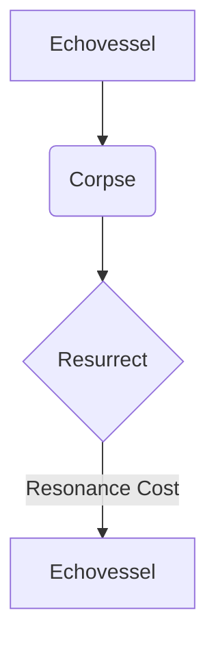
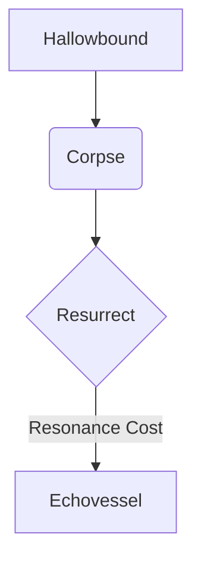
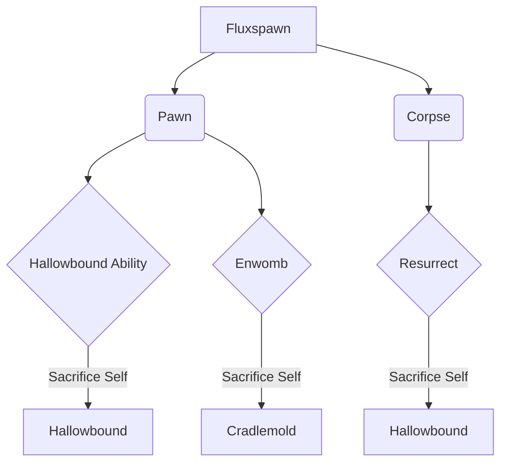
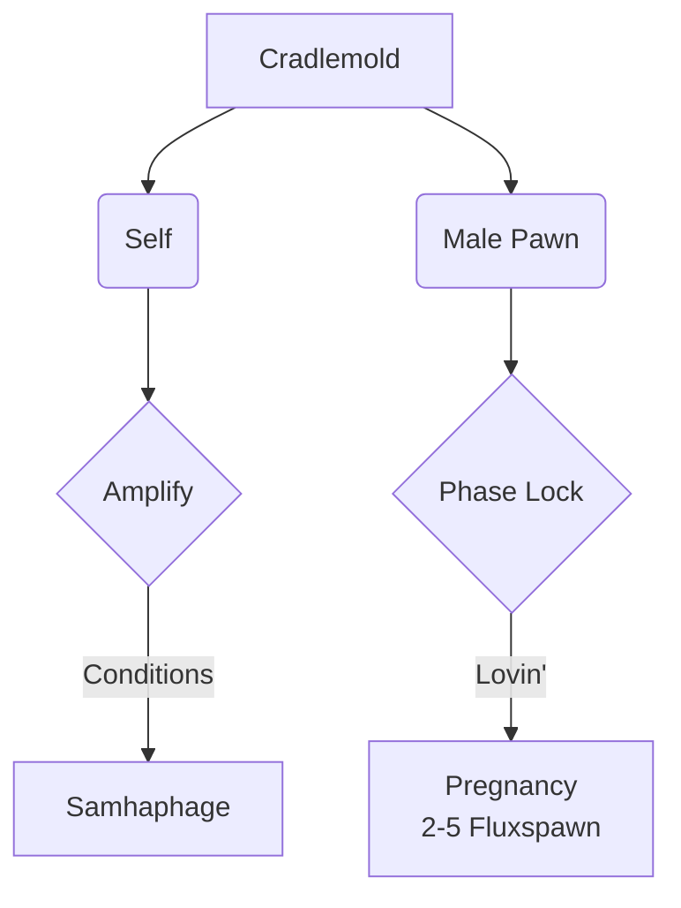
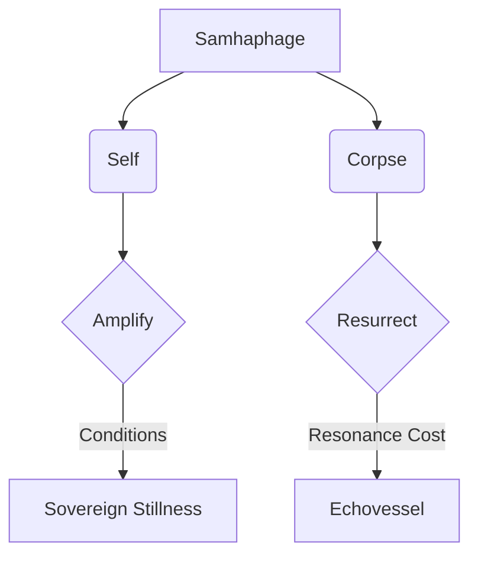
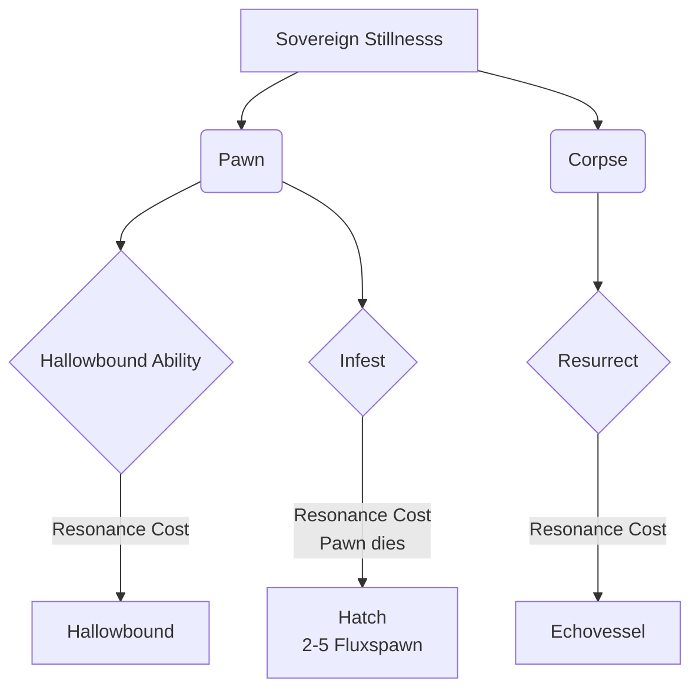

# REPRODUCTION

## Echovessel

```mermaid
flowchart TD
   A[Echovessel] --> B(Corpse)
   B --> C{Resurrect}
   C -->|Resonance Cost| D[Echovessel]
```

## Hallowbound

```mermaid
flowchart TD
   A[Hallowbound] --> B(Corpse)
   B --> C{Resurrect}
   C -->|Resonance Cost| D[Echovessel]
```

## Fluxspawn

```mermaid
flowchart TD
    A[Fluxspawn] --> B(Pawn)
    B --> C{Hallowbound Ability}
    C -->|Sacrifice Self| D[Hallowbound]
    B --> E{Enwomb}
    E -->|Sacrifice Self| F[Cradlemold]
    A --> J(Corpse)
    J --> K{Resurrect}
    K -->|Sacrifice Self| L[Hallowbound]
```

## Cradlemold

```mermaid
flowchart TD
    A[Cradlemold] --> B(Self)
    B --> C{Amplify}
    C -->|Conditions| D[Samhaphage]
    A --> G(Male Pawn)
    G --> H{Phase Lock}
    H -->|Lovin'| I[Pregnancy <br /> 2-5 Fluxspawn]
```

## Samhaphage

```mermaid
flowchart TD
    A[Samhaphage] --> B(Self)
    B --> C{Amplify}
    C -->|Conditions| D[Sovereign Stillness]
    A --> M(Corpse)
    M --> N{Resurrect}
    N -->|Resonance Cost| O[Echovessel]
```

## Sovereign Stillness

```mermaid
flowchart TD
    A[Sovereign Stillnesss]
    A --> B(Pawn)
    B --> C{Hallowbound Ability}
    C -->|Resonance Cost| D[Hallowbound]
    B --> G{Infest}
    G -->|Resonance Cost <br /> Pawn dies| H[Hatch <br /> 2-5 Fluxspawn]
    A --> M(Corpse)
    M --> N{Resurrect}
    N -->|Resonance Cost| O[Echovessel]
```
